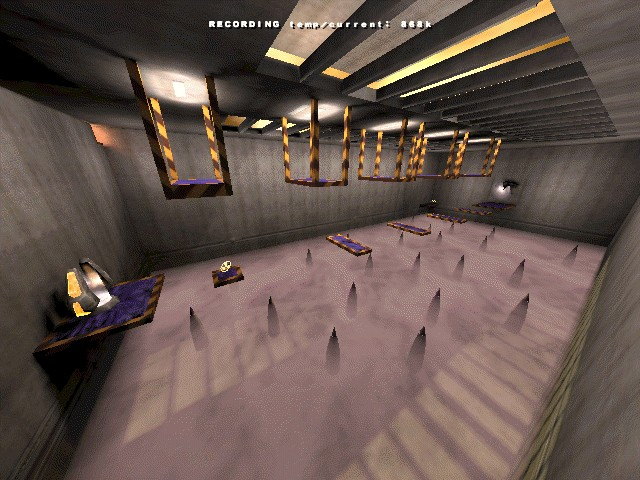
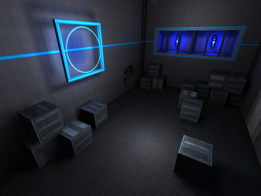
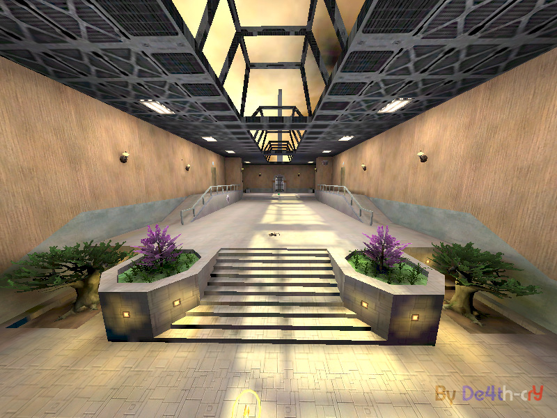

## General

Some **Quake 3 arena** maps I created a long time ago (early 2004) for the **DeFRag** mod.

Build with **GTK Radiant 1.5.0** for **DeFRag 1.9**.

Of course there are much more better tools and resources now to build awesome maps, they are not optimized, but these are the original ones! :)

## Maps

### de4th_run1

- Type : run
- Physics : VQ3
- Weapons : Plasmagun
- Items : Battle suit, Haste

### de4th_run2

- Type : run
- Physics : VQ3
- Weapons : Rocket Launcher
- Items : Battle suit, Haste

### acc_fuzzle

- Type : accuracy
- Physics : VQ3, CPM
- Weapons : Railgun
- Items : Haste

## Usage

Just put the `.pk3` files in your _q3base_ folder.

## Licence

[General Public License (GPL) v3](https://www.gnu.org/licenses/gpl-3.0.en.html)

This program is free software: you can redistribute it and/or modify it under the terms of the GNU
General Public License as published by the Free Software Foundation, either version 3 of the
License, or (at your option) any later version.

This program is distributed in the hope that it will be useful, but WITHOUT ANY WARRANTY; without
even the implied warranty of MERCHANTABILITY or FITNESS FOR A PARTICULAR PURPOSE. See the GNU
General Public License for more details.
    
You should have received a copy of the GNU General Public License along with this program.  If not,
see <http://www.gnu.org/licenses/>.

## Contributing

Feel free to fork the project and/or create pull requests.
